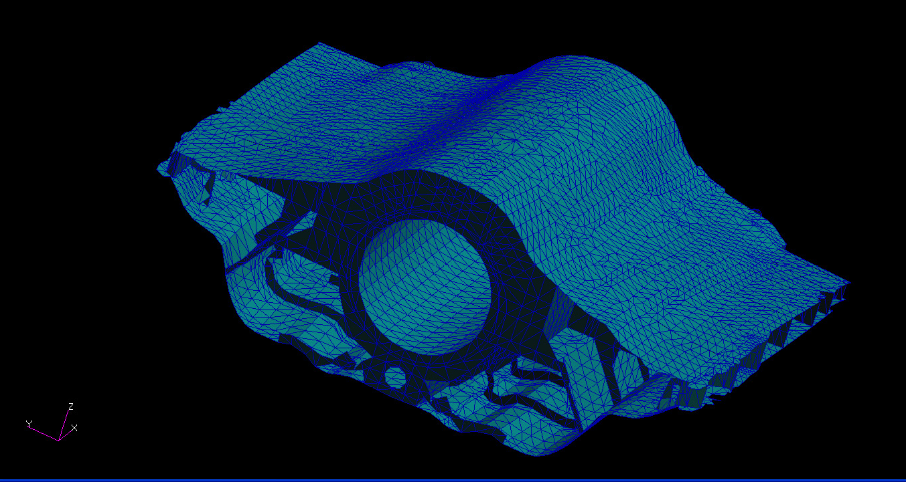

# ========================================
# Utility to Convert NASTRAN BDF File to TRASYS Input File:
# ========================================

## Utility to Convert NASTRAN BDF File to TRASYS Input File.

##
## I. Source NASTRAN FEM Mesh to Convert to TRASYS Input Format:

##
## II. Utility Executable: "./bin/nastra.exe"

##
## III. Utility Input File: "./input/rear_section_a.bdf"
    =================================
    START: "rear_section_a.bdf"
    =================================
    ... CONTENT REMOVED ...
    $ Direct Text Input for Global Case Control Data
    SUBCASE 1
    $ Subcase name : Default
       SUBTITLE=Default
       NLPARM = 1
       THERMAL(SORT1,PRINT)=ALL
       FLUX(SORT1,PRINT)=ALL
    BEGIN BULK
    PARAM    POST    0
    PARAM    AUTOSPC YES
    PARAM    SIGMA   1.714-9
    NLPARM   1       0               AUTO    5       25      PW      NO
                     .001    1.-7
    $ Direct Text Input for Bulk Data
    $ Elements and Element Properties for region : pshell.224
    PSHELL*  224             1               .00667
    *
    $ Pset: "pshell.224" will be imported as: "pshell.224"
    CTRIA3   28140   224     18034   18028   18062   0.
    CTRIA3   28341   224     21480   21506   21474   84.544
    CTRIA3   54553   224     7879    7882    7883   -57.21
    CTRIA3   54554   224     7883    7880    7879   -57.21
    CTRIA3   71763   224     17050   423     422    -95.542
    ... CONTENT REMOVED ...
    =================================
    END: "rear_section_a.bdf"
    =================================

##
## IV. Utility Output Files:
### IV.a. "./output/rear_section_a.tra"
    =================================
    START: "rear_section_a.tra"
    =================================
    S     SURFN=28140 $ ^   224
           TYPE=POLY
           ACTIVE=TOP
           ALPHA =    1.000
           EMISS =    1.000
           P1=      44.140,      -7.288,       7.621
           P2=      44.140,      -7.288,       7.917
           P3=      44.087,      -7.576,       7.649
    C
    S     SURFN=28341 $ ^   224
           TYPE=POLY
           ACTIVE=TOP
           ALPHA =    1.000
           EMISS =    1.000
           P1=      44.140,       7.288,       7.621
           P2=      44.087,       7.576,       7.649
           P3=      44.140,       7.288,       7.917
    C
    S     SURFN=54553 $ ^   224
           TYPE=POLY
           ACTIVE=TOP
           ALPHA =    1.000
           EMISS =    1.000
           P1=      37.500,       1.819,       5.964
           P2=      37.500,       1.708,       5.796
           P3=      37.500,       1.760,       5.756
    C
    ... CONTENT REMOVED ...
    =================================
    START: "rear_section_a.tra"
    =================================

### IV.b. "./output/rear_section_a.diag"
